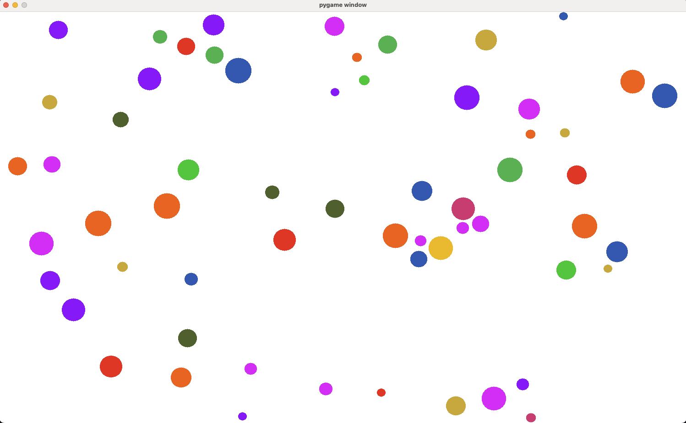

# Physics Ball Project

## Description

The Physics Ball project is a Python-based simulation that models the motion of a ball under the influence of gravity and other physical forces. It aims to provide a realistic representation of the ball's behavior in a 2D environment.

## Features

- Simulates the motion of a ball in a 2D space.
- Accounts for gravity, friction, and other physical forces.
- Allows customization of initial conditions such as position, velocity, and mass.
- Provides visual representation of the ball's trajectory.
- Supports interactive controls for adjusting simulation parameters in real-time.

## Installation

To run the Physics Ball project, follow these steps:

1. Clone the repository: `git clone https://github.com/username/physics_ball.git`
2. Navigate to the project directory: `cd physics_ball`
3. Create your virtual environment with `conda` : `conda create --name my_physics_env python=3.11 -y`
4. Activate your environment : `conda activate my_physics_env`
3. Install the required dependencies: `python -m pip install -r requirements.txt`

## Usage

To start the simulation, run the following command:

`python -m physics_ball`

You should be able to see a window running the simulation !

